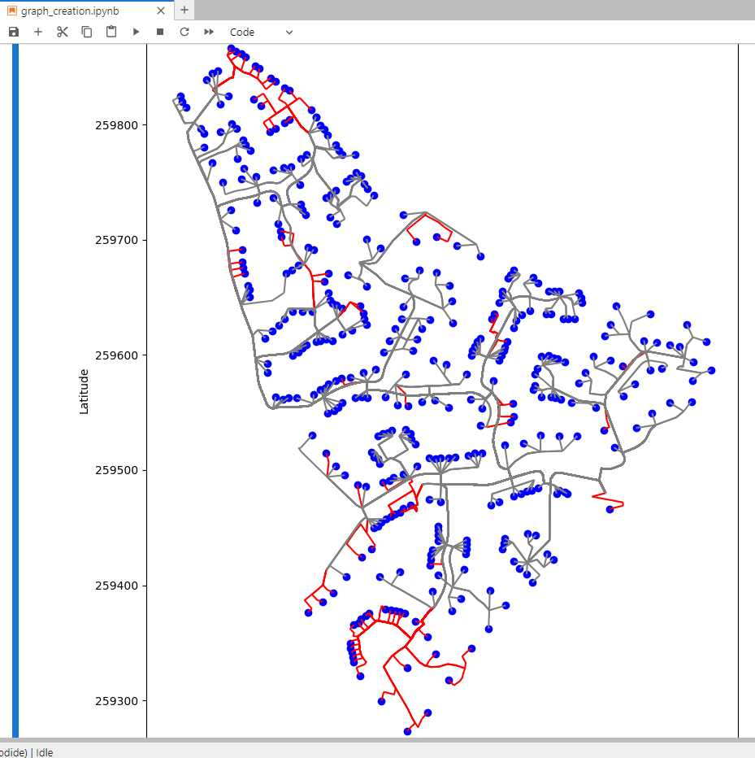
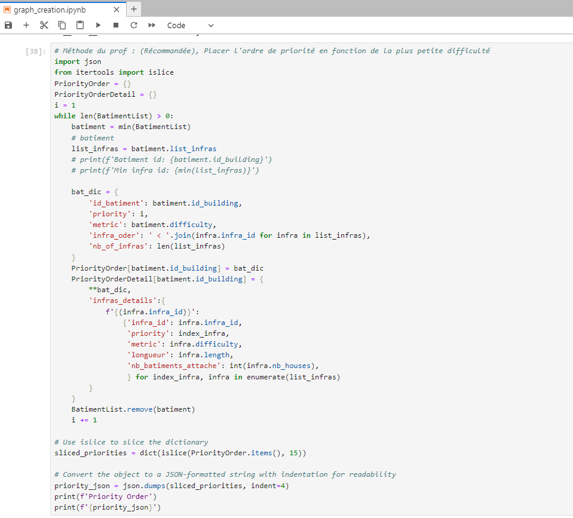
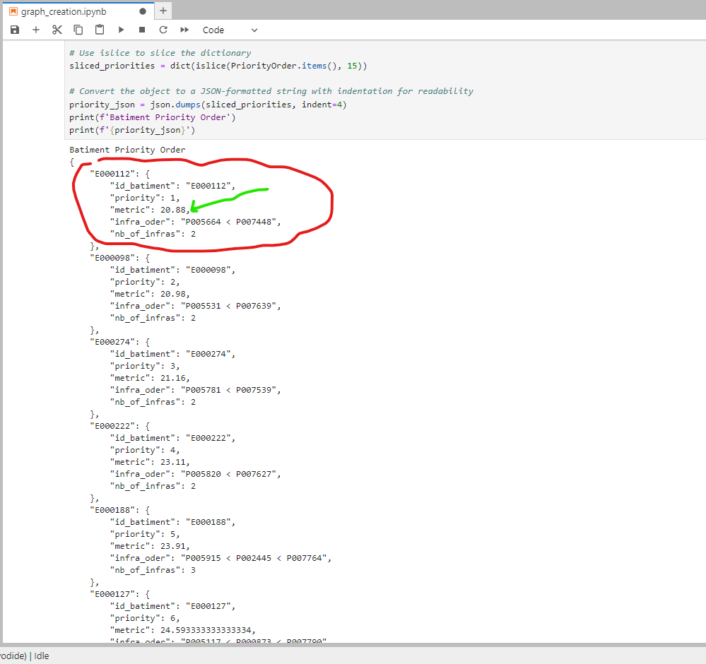

# Metric Test Town Repairing v0.1

  
  
  

# Doc
 -Jupyter: <a href="https://github.com/VPoussou/town_electricity_rebuild/blob/master/doc/jupter" _target> Notre Notebook</a>

# Contributors
 - Joel Ivan Sobgui
 - Valentin Poussou
 - Lazare

# Licence
MIT
