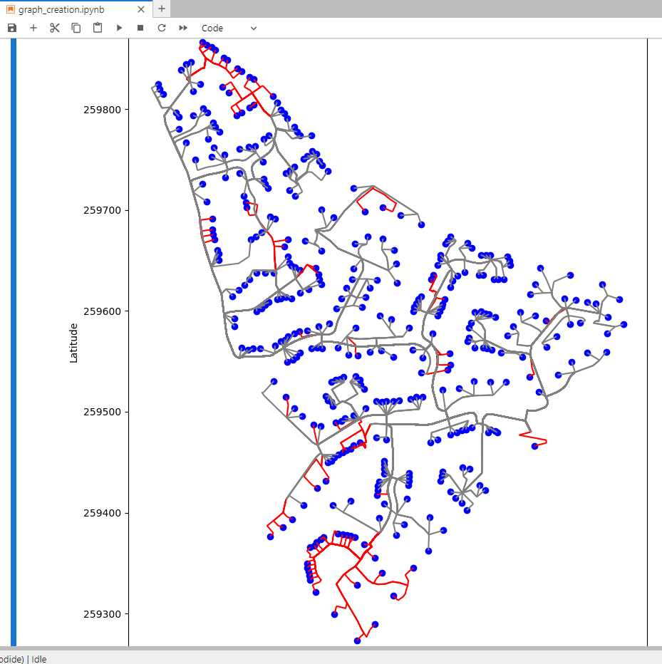
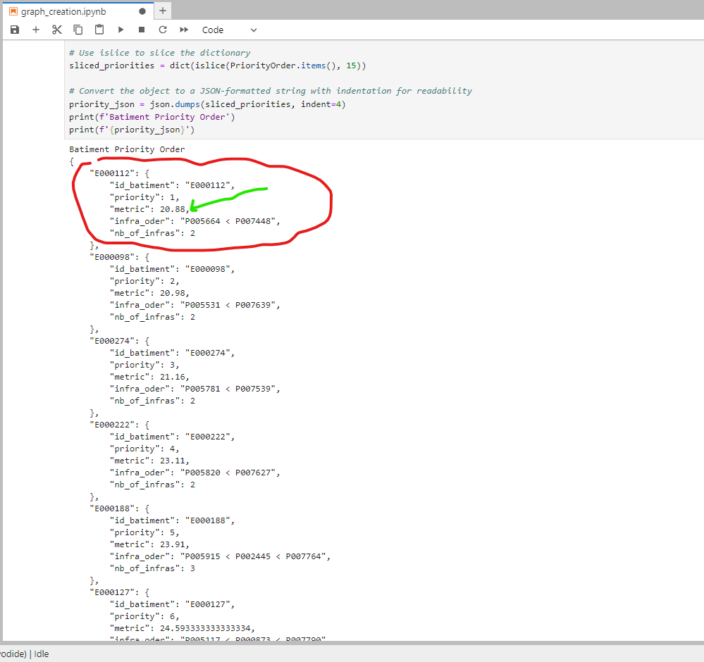
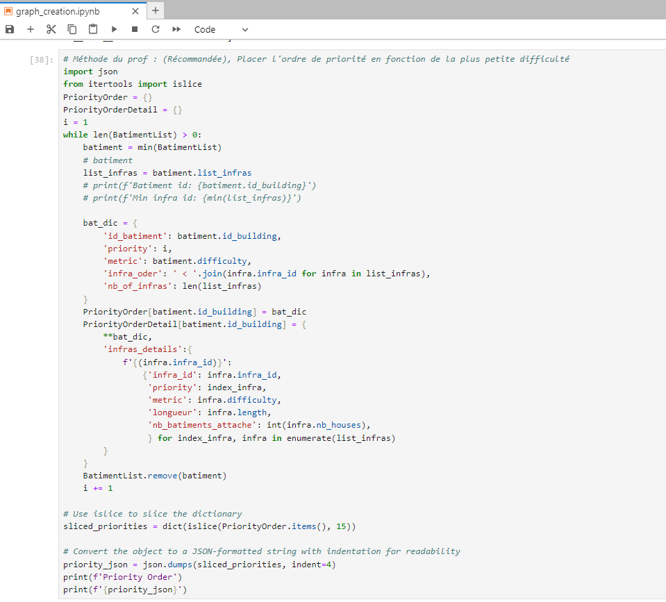

# Metric Test Town Repairing v0.1

  
  
  

# Steps
With a venv and the requirements installed, running the main.py file will print the list of infras, in graph_creation.ipynb, more detailed steps and graphs can be found.

# Contributors
 - Joel Ivan Sobgui
 - Valentin Poussou
 - Lazare Nogrette

# Licence
MIT

# Folders
data : contains the csv data and shapefiles
documentation : contains an early report on how we started understanding the problem
img : contains a few screen captures relevant to our work
src : contains the modular version of the project